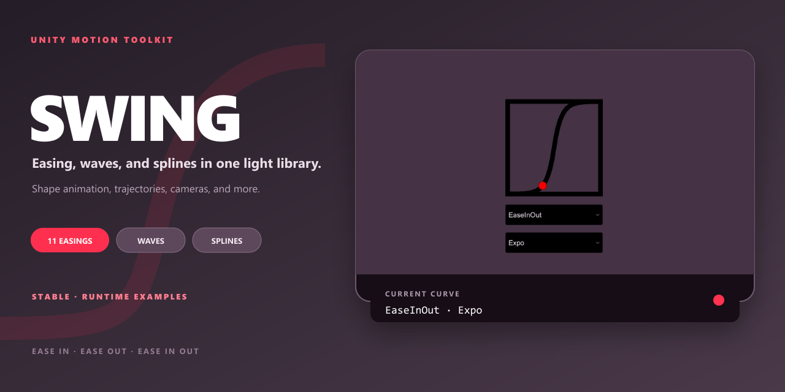

# Swing

[简体中文](README.zh-CN.md)

A Unity-friendly collection of easing, waveform, spline, and noise functions.



## What it includes

- Easing and wave functions.
- Splines and reusable math utilities.
- Unity samples and tests.

## Getting started

In Unity, open **Window → Package Manager**, choose **Add package from git URL**, and enter:

```text
https://github.com/onovich/Swing.git?path=/Assets/com.mortise.swing#main
```

The package metadata declares Unity `2019.4` or later.

The repository can also be opened as a Unity sample project.

## Example

```csharp
// In Unity Project
var timer = 10f;
Color color;
Vector2 pos;
float x;

void Update() {
    timer -= Time.deltaTime;
    color = EasingHelper.EasingColor(Color.black, Color.red, timer, 10f, EasingType.Sine, EasingMode.EaseInOut); 
    pos = EasingHelper.Easing2D(Vector2.zero, Vector2.one, timer, 10f, EasingType.Linear, EasingMode.None);
    x = EasingHelper.Easing(-1f, 1f, timer, 10f, EasingType.Back, EasingMode.EaseIn);
}
```

## Repository map

- `Assets/` — Unity scripts, scenes, packages, and authored assets.
- `Packages/` — Unity package dependencies.
- `ProjectSettings/` — Unity project configuration.

## Related projects

- [Sway](https://github.com/onovich/Sway)

## Status

The current repository describes Swing as stable and available, and includes runtime samples and tests.

## License

This repository is licensed under [MIT](LICENSE).
